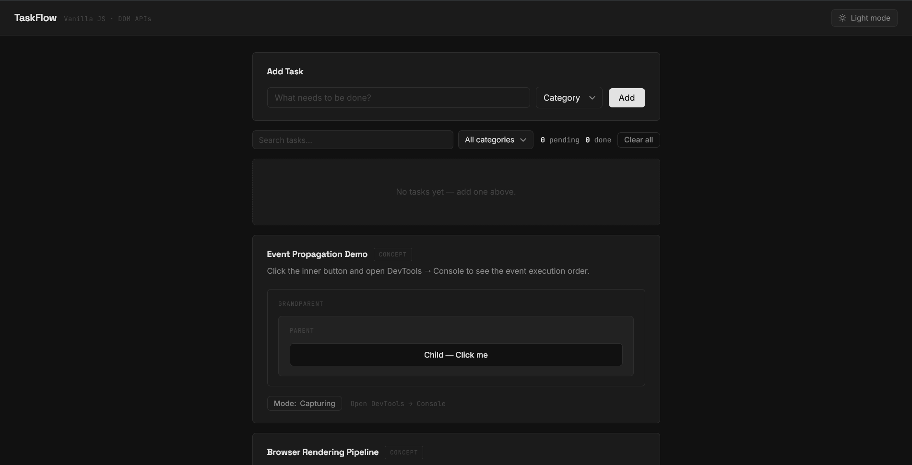
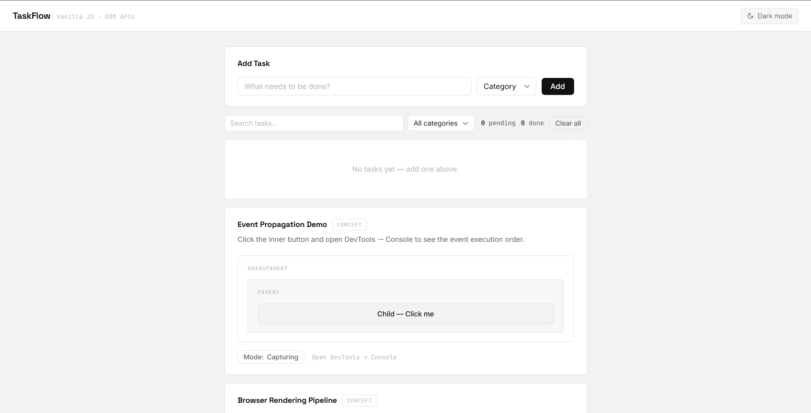
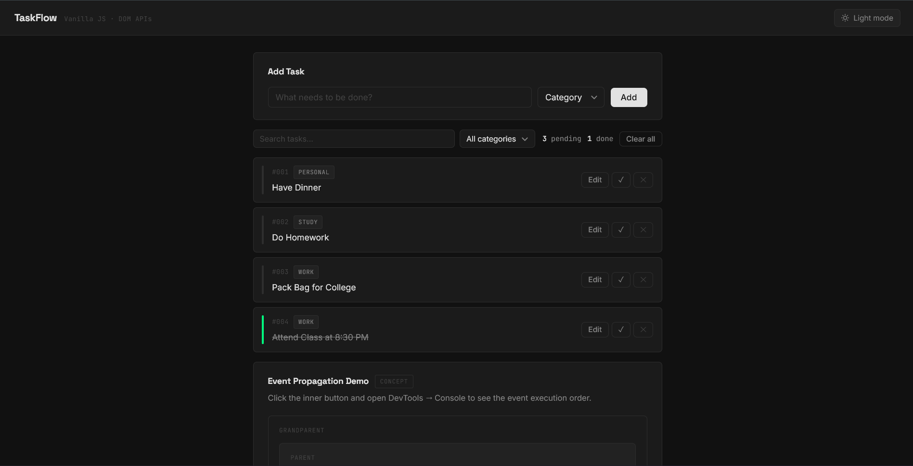
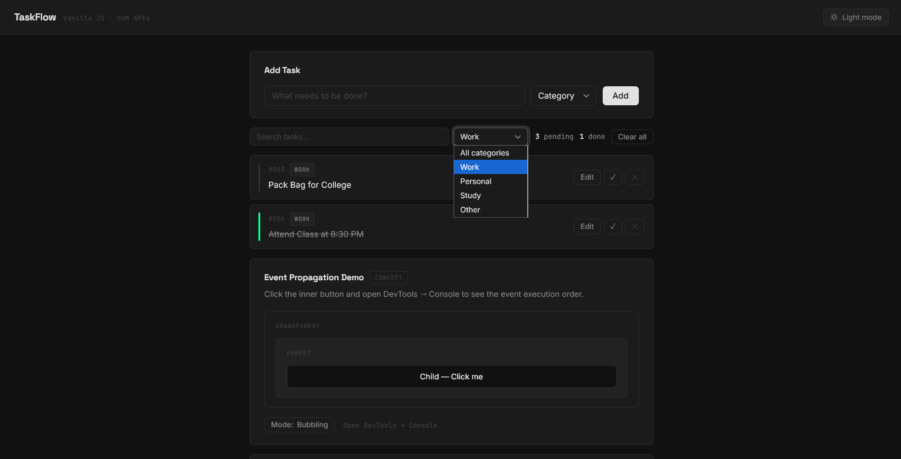
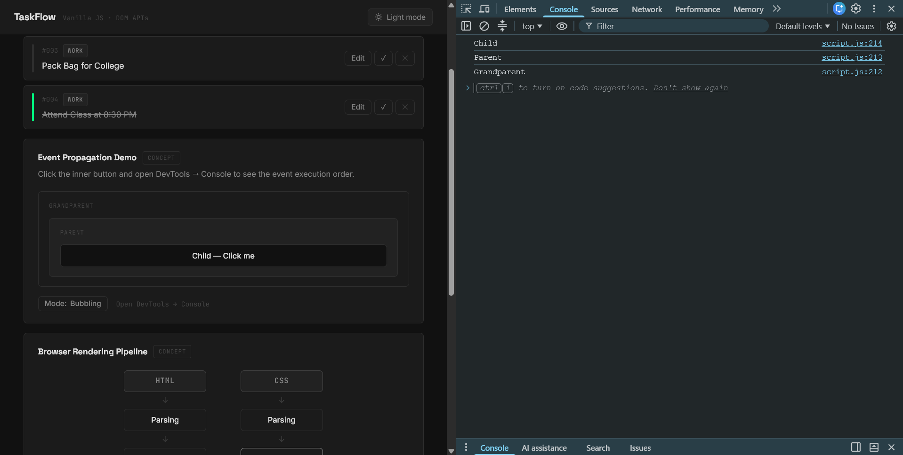
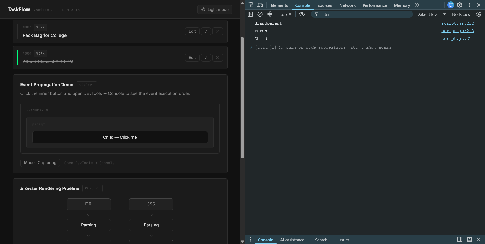
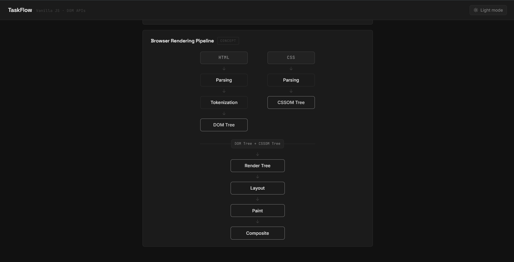

# TaskFlow

A task manager built with nothing but **HTML, CSS, and Vanilla JavaScript** — no frameworks, no libraries. The point of this project wasn't just to manage tasks, but to work directly with the DOM APIs and browser mechanics that frameworks usually abstract away.

**🔗 Live Demo:** [task-flow-one-snowy-73.vercel.app](https://task-flow-one-snowy-73.vercel.app/)


---

## 📸 Screenshots

### Dashboard — Dark Mode


### Dashboard — Light Mode


### Task List in Action


### Search & Category Filter


### Event Propagation Demo (Console Output)



### Browser Rendering Pipeline Diagram


---

## 📖 Table of Contents

- [Features](#-features)
- [Tech Stack](#-tech-stack)
- [Browser Rendering Pipeline](#-browser-rendering-pipeline)
- [Attributes vs Properties](#-attributes-vs-properties)
- [Event System: Bubbling, Capturing & Delegation](#-event-system-bubbling-capturing--delegation)
- [Project Structure](#-project-structure)
- [Getting Started](#-getting-started)
- [Screenshots](#-screenshots)

---

## ✨ Features

- **Add tasks** with a title and category, rendered instantly with no page reload
- **Edit tasks** inline — the task card is swapped for an editable input, then rebuilt on save
- **Mark tasks complete** with a single click — toggles a `data-status` attribute that drives the visual state via CSS
- **Delete tasks** individually, or clear the entire list at once
- **Live search** that filters the task list as you type
- **Filter by category**, combinable with search at the same time
- **Pending / completed counters** that stay in sync with the task list
- **Dark / light theme toggle**, switched entirely through a single `data-theme` attribute on `<html>`
- **Persistent storage** — tasks survive a page refresh via `localStorage`
- **Live event propagation demo** — toggle between bubbling and capturing and watch the execution order change in the console
- **Visual Browser Rendering Pipeline diagram**

---

## 🛠 Tech Stack

| Layer | Technology |
|---|---|
| Structure | HTML5 |
| Styling | CSS3 (Custom Properties for theming, Flexbox layout) |
| Behavior | Vanilla JavaScript (ES6+) — zero dependencies |
| Storage | Browser `localStorage` |
| Deployment | Vercel |

---

## 🧬 Browser Rendering Pipeline

Before a browser can show anything on screen, it runs the HTML and CSS through a multi-stage pipeline. This project includes a visual diagram of that pipeline, explained here in more depth:

**Parsing**
The browser reads the raw HTML source, character by character, to understand the structure of the document — which tags exist and how they're nested.

**Tokenization**
A sub-step of parsing. The HTML parser breaks the markup into a stream of tokens — start tags, end tags, attribute names, attribute values, and text — before any tree is built. Tokens are the raw units the parser hands off to the next stage.

**DOM Tree**
The parser turns those tokens into nodes, and connects the nodes into a tree based on how the tags were nested in the source. This tree — the Document Object Model — is what JavaScript actually reads and manipulates. Every `document.createElement()`, `.append()`, and `.remove()` call in `script.js` is operating directly on this tree.

**CSSOM Tree**
While the DOM Tree is being built from HTML, the browser separately parses all CSS — external stylesheets and `<style>` tags — into the CSS Object Model. It's structurally similar to the DOM Tree, but represents style rules and their computed relationships (specificity, inheritance, cascade) instead of document structure.

**Render Tree**
The DOM Tree and CSSOM Tree are combined into a Render Tree — but only nodes that will actually be visible. Elements with `display: none` (like `.task-card[style*="display: none"]` when search/filter hides a card) are excluded entirely; their subtree is skipped in the render tree even though they still exist in the DOM.

From there, the browser calculates **Layout** (the exact size and position of every render tree node), **Paint** (filling in pixels — color, text, borders, shadows), and **Composite** (layering everything together into the final frame on screen). All three stages are included in the pipeline diagram in the app.

---

## 🔍 Attributes vs Properties

A subtle but important distinction demonstrated in this project (see the `addTaskBtn` click handler in `script.js`):

```js
console.log('Property (input.value):', taskTitleInput.value)
console.log('Attribute (getAttribute):', taskTitleInput.getAttribute('value'))
```

- **Property** (`input.value`) reflects the *live* state of the DOM — it updates in real time as the user types.
- **Attribute** (`input.getAttribute('value')`) reflects only the *original* HTML markup — it stays frozen at whatever was written in the source, regardless of what the user types afterward.

Open the browser console and add a task to see both logged side by side.

Beyond the form input, every task card also relies on custom data attributes — `data-id`, `data-status`, `data-category` — read and written through `setAttribute()`, `getAttribute()`, and the `dataset` API. These attributes are what drive the card's visual state purely through CSS (e.g. `.task-card[data-status="complete"]` triggers the strikethrough and status-bar color change), with no inline style manipulation needed in JS.

---

## 🔁 Event System: Bubbling, Capturing & Delegation

This project includes a dedicated **live demo** (Grandparent → Parent → Child) where you can toggle between bubbling and capturing and watch the console output change order in real time — but the same mechanics are also doing real work elsewhere in the app.

**Event Bubbling**
When an event fires on an element, it doesn't stop there — it travels back up through every ancestor, from the target outward to the root. This is the default phase (`addEventListener`'s third argument is `false` or omitted).

**Event Capturing**
The opposite direction: the event travels from the outermost ancestor *down* toward the target first, before the bubbling phase even begins. Triggered by passing `true` as the third argument to `addEventListener`.

**Event Delegation**
A practical technique built directly on top of bubbling. Instead of attaching a separate listener to every task card's Edit/Complete/Delete/Save buttons — which would be impossible anyway, since cards are created dynamically *after* the page loads — a single listener sits on the parent `#taskList` container. Every click inside it bubbles up to that one listener, which reads `e.target.closest('.task-card')` and the clicked button's `data-action` attribute to figure out what to do. One listener handles an unlimited number of cards, including ones that don't exist yet at page load.

---

## 📂 Project Structure

```
taskflow/
├── index.html      # Markup — form, task list, propagation demo, pipeline diagram
├── style.css        # Theming (CSS custom properties), layout, all component styles
├── script.js         # All DOM logic, event handling, delegation, localStorage
├── screenshots/      # Screenshots for demonstration
    ├── dashboard-dark.png
    ├── dashboard-light.png
    ├── task-list.png
    ├── search-filter.png
    ├── propagation-console-bubbling.png
    ├── propagation-console-capturing.png
    ├── pipeline-diagram.png
└── README.md
```

---

## 🚀 Getting Started

No build step, no dependencies, no installation.

```bash
git clone https://github.com/biswajeet-4341/taskflow.git
cd taskflow
```

Then just open `index.html` in a browser — or use a local server (e.g. the VS Code Live Server extension) for the best experience.

---

## 👤 Author

**Biswajeet**
GitHub: [@biswajeet-4341](https://github.com/biswajeet-4341)

---

*UI/UX design built with the help of Claude — all functionality, logic, and feature implementation written independently.*